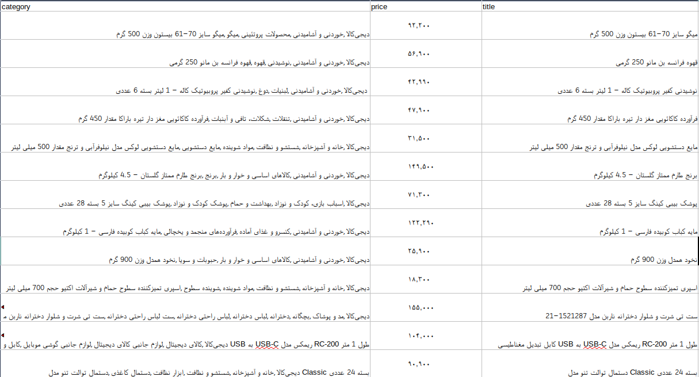

# Digikala_Crawler
A simple program to crawl Digikala items and save them on a .csv file

## What is this?
This is a very simple program to get every item on [Digikala](https://www.digikala.com) and saves them on a csv file. This program uses Python and Scrapy library. For every item it saves price, name

## How to Use?
After downloading repository you should just change directory to spider and type following command:

```
scrapy crawl Digikala -o csv_file_name.csv -t csv
```
After using this command crawler starts to crawl every item on [Digikala](https://www.digikala.com) and saves them on a csv file.

## Example
After the program is finished, you can refer to your .csv file and see its contents. The content is something like the following figure.


